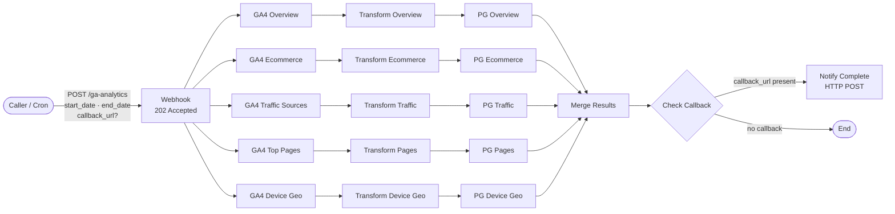
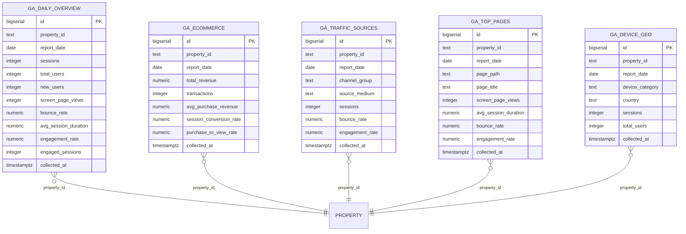
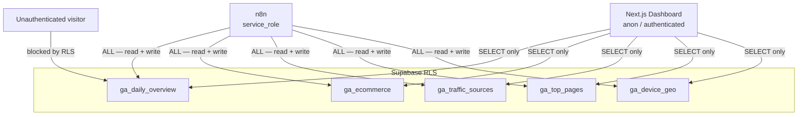
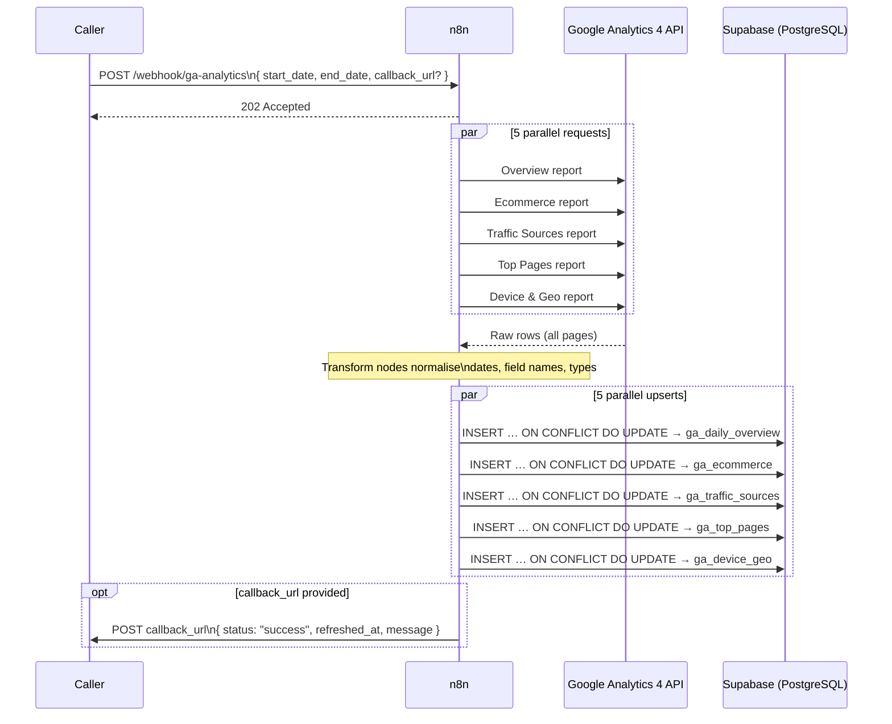

# Google Analytics Dev Overview

A concise reference for the GA4 → Supabase data pipeline that powers the marketing dashboard.

---

## 1. System Overview

The pipeline is driven by an **n8n workflow** (`n8n-workflow-ga4.json`). An external caller (e.g. the Next.js dashboard or a cron job) triggers it via a **POST webhook**. n8n fans out five parallel GA4 Data API requests, transforms each response, and upserts the results into five **Supabase/PostgreSQL** tables. An optional callback URL is notified on completion.

```
Caller ──POST──▶ n8n Webhook ──▶ (5× parallel) GA4 API ──▶ Transform ──▶ Supabase
                                                                              │
                                                               Callback ◀────┘
```

---

## 2. n8n Workflow Architecture

### 2.1 High-level flow



### 2.2 Node responsibilities

| Stage | Nodes | What happens |
|---|---|---|
| **Trigger** | `Webhook` | Receives `{ start_date, end_date, callback_url? }`, immediately returns `202 Accepted` |
| **Fetch** | `GA4 Overview/Ecommerce/Traffic Sources/Top Pages/Device Geo` | Parallel GA4 Data API calls (OAuth2), custom date range, `returnAll: true` |
| **Transform** | `Transform *` (5× Code nodes) | Normalise field names, convert GA4 `YYYYMMDD` date strings to `YYYY-MM-DD`, cast types, attach `property_id` + `collected_at` |
| **Write** | `PG *` (5× Postgres nodes) | Parameterised `INSERT … ON CONFLICT … DO UPDATE` (upsert), batched independently per row |
| **Merge** | `Merge Results` | Append all five streams back into one |
| **Notify** | `Check Callback` + `Notify Complete` | If `callback_url` was in the original body, POST `{ status, refreshed_at, message }` |

---

## 3. Database Schema

### 3.1 Entity-relationship diagram



> All five tables share the same **logical key**: `(property_id, report_date)` — extended with additional dimension columns where needed. Upserts are safe to re-run for any date range.

### 3.2 Unique constraints & indexes

| Table | Unique key | Extra indexes |
|---|---|---|
| `ga_daily_overview` | `(property_id, report_date)` | `(property_id, report_date DESC)` |
| `ga_ecommerce` | `(property_id, report_date)` | `(property_id, report_date DESC)` |
| `ga_traffic_sources` | `(property_id, report_date, channel_group, source_medium)` | `(property_id, report_date DESC)` |
| `ga_top_pages` | `(property_id, report_date, page_path)` | `(property_id, report_date DESC)`, `(property_id, screen_page_views DESC)` |
| `ga_device_geo` | `(property_id, report_date, device_category, country)` | `(property_id, report_date DESC)` |

---

## 4. Security Model



| Role | Grant | RLS Policy |
|---|---|---|
| `service_role` (n8n) | `ALL` on all tables + sequences | `Allow service role write` — full read/write |
| `authenticated` (dashboard user) | `SELECT` on all tables | `Allow read for authenticated` — read-only |
| `anon` | `SELECT` on all tables (schema-level) | No policy → blocked by RLS |

---

## 5. Data Flow — End to End



---

## 6. GA4 Property

| Field | Value |
|---|---|
| Property ID | `523852603` |
| Property name | Veracity AI |
| Credential | `Google Analytics account 2` (OAuth2) |

---

## 7. How to Trigger a Refresh

```http
POST https://<n8n-host>/webhook/ga-analytics
Content-Type: application/json

{
  "start_date": "2024-01-01",
  "end_date":   "2024-01-31",
  "callback_url": "https://your-app.com/api/ga4-refresh-done"
}
```

- `start_date` / `end_date` — ISO-8601 dates; forwarded verbatim to the GA4 Data API.
- `callback_url` — optional; if present, n8n will POST a completion signal once all five upserts finish.
- The webhook returns **202** immediately; processing is async.
